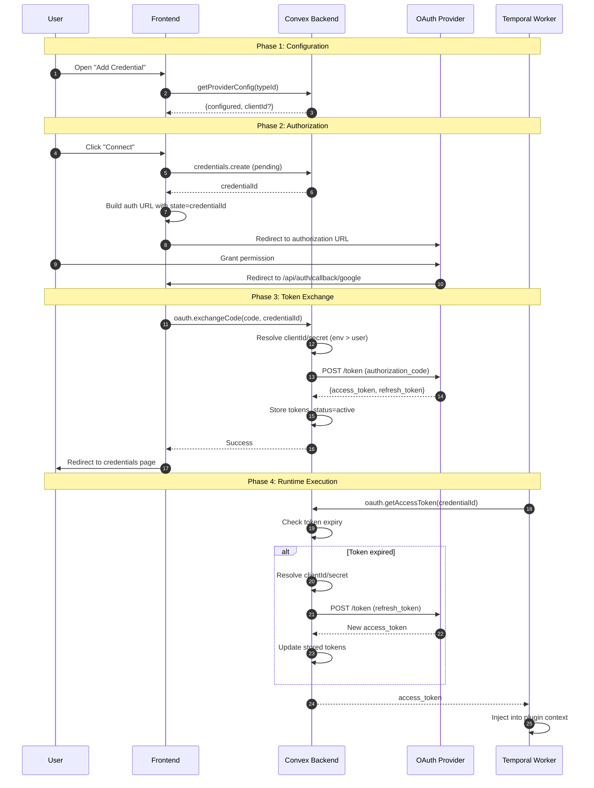
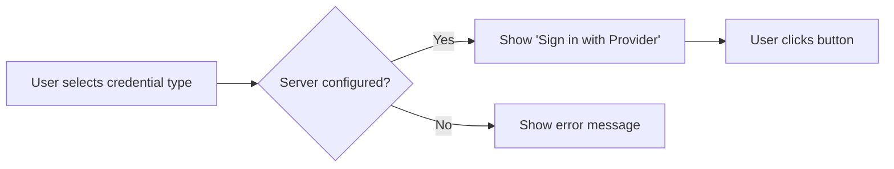
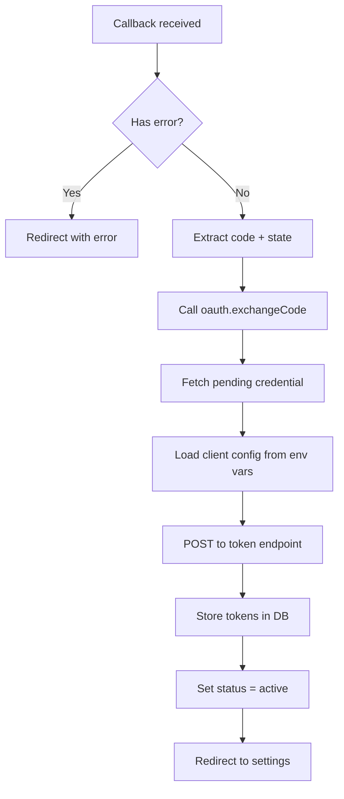
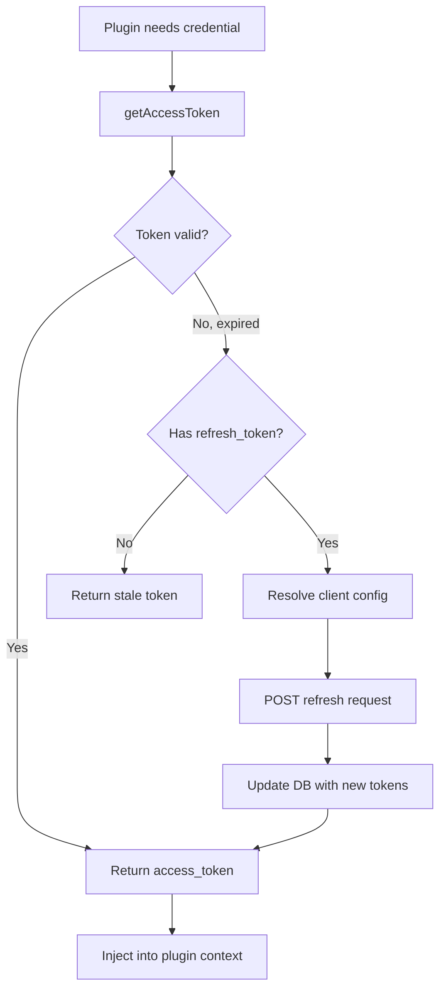

# OAuth2 Credential System Flow

This document outlines how OAuth2 credentials are configured, authorized, and used within the Kianax plugin system.

## Overview

## Detailed Flow

### 1. Configuration Check

When a user opens the credential dialog, the frontend queries the server to check if OAuth client credentials are configured via environment variables.

**Code path:** `credentials/page.tsx` → `api.oauth.getProviderConfig`

### 2. Authorization Flow

The frontend creates a pending credential record, then redirects the user to the OAuth provider with a specially crafted URL.

| Parameter | Value | Purpose |
|-----------|-------|---------|
| `response_type` | `code` | Request authorization code |
| `client_id` | From server or user | Identify the application |
| `redirect_uri` | `/api/auth/callback/google` | Where to return after auth |
| `scope` | Defined per credential type | Requested permissions |
| `state` | `credentialId` | Link callback to pending record |
| `access_type` | `offline` | Request refresh token |
| `prompt` | `consent` | Force consent screen |

### 3. Token Exchange

After the user grants permission, the provider redirects back with an authorization code. The Next.js API route handles this callback server-side for security.

**Code path:** `/api/auth/callback/google` → `api.oauth.exchangeCode` → `lib/oauth.ts`

### 4. Runtime Token Retrieval

When a workflow executes a plugin requiring OAuth credentials, the system automatically handles token refresh.

**Expiry buffer:** Tokens are refreshed 5 minutes before actual expiry to prevent mid-execution failures.

## Key Components

| Component | Location | Responsibility |
|-----------|----------|----------------|
| `CreateCredentialDialog` | `apps/web/.../credentials/page.tsx` | UI for adding credentials, adapts based on server config |
| `/api/auth/callback/google` | `apps/web/app/api/auth/callback/google/route.ts` | Server-side OAuth callback handler |
| `oauth.exchangeCode` | `apps/server/convex/oauth.ts` | Exchanges auth code for tokens |
| `oauth.getAccessToken` | `apps/server/convex/oauth.ts` | Retrieves/refreshes tokens at runtime |
| `resolveOAuth2Config` | `apps/server/convex/lib/oauth.ts` | Loads client credentials from env vars |
| `fetchOAuth2Token` | `apps/server/convex/lib/oauth.ts` | Generic OAuth2 token endpoint caller |

## Configuration

OAuth client credentials must be configured via environment variables:

| Provider | Environment Variables |
|----------|----------------------|
| Google (Calendar, Sheets, etc.) | `GOOGLE_CLIENT_ID`, `GOOGLE_CLIENT_SECRET` |

If the required environment variables are not set, users will see an error message and cannot add OAuth credentials.

For self-hosted deployments, administrators must:
1. Create an OAuth app in the provider's developer console (e.g., Google Cloud Console)
2. Set the redirect URI to `https://your-domain.com/api/auth/callback/google`
3. Add the client credentials to the server environment variables
